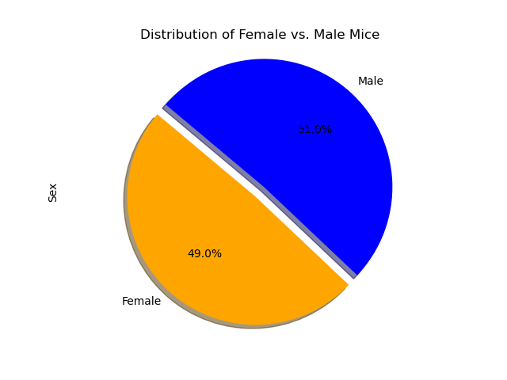
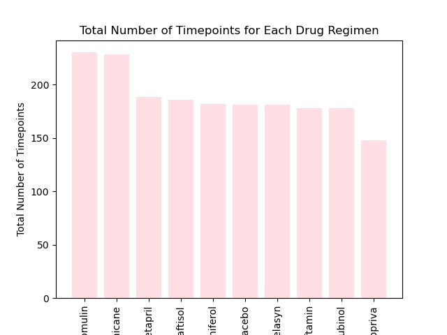
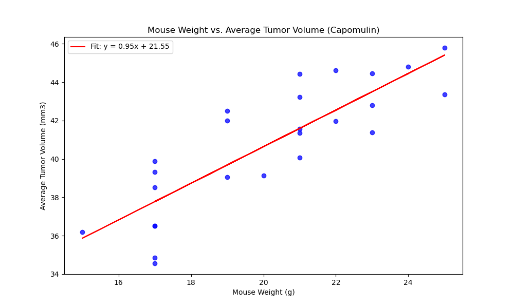
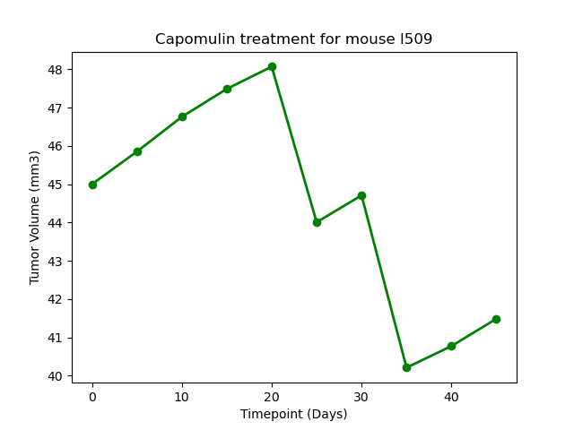

# Tumor Growth Inhibition Study - Pymaceuticals

This repository contains data analysis and visualizations from an animal study focusing on potential treatments for **squamous cell carcinoma (SCC)**, a common form of skin cancer.

## Project Overview
The study involved 249 mice with SCC tumors. The mice were treated with various drug regimens over a 45-day period, and tumor growth was monitored. The purpose of this study was to compare the effectiveness of the Pymaceuticals drug, **Capomulin**, against other treatment regimens.

## Repository Contents
- **data/**: Contains the raw and processed CSV files used for the analysis.
- **pymaceuticals_notebook.ipynb**: The Jupyter notebook with all the analysis and visualizations.
- **Output/**: Contains all the saved plots and figures generated during the analysis.


## Analysis Overview

### Data Preparation
- Mouse metadata and study results were merged, and any duplicate data was removed before proceeding with the analysis.

### Visualizations

#### Tumor Volume Distribution - Boxplot
The box plot shows the final tumor volumes across four different drug regimens. This highlights the effectiveness of the drugs based on tumor reduction.

(Output/boxplot.png)

#### Gender Distribution of Mice - Pie Chart
The pie chart illustrates the distribution of male and female mice used in the study.



#### Total Timepoints for Each Drug Regimen - Bar Chart
This bar chart shows the total number of timepoints for each drug regimen tested during the study.



#### Tumor Volume vs. Mouse Weight - Scatter Plot with Regression Line
This scatter plot shows the relationship between mouse weight and the average tumor volume for the Capomulin treatment regimen. A regression line has been added to illustrate the correlation between these variables.



#### Tumor Volume Over Time for Mouse Treated with Capomulin - Line Plot
This line plot shows how the tumor volume for a single mouse treated with Capomulin changed over time.




### Analysis

A strong Positive correlation is found between the the weight of the mouse treated with Capomuin and average tumor volume.

The tumor volume for mouse l509 decreased over the course of the Capomulin drug regimen. The final tumor volume on the last day of treatment(day 45) was smaller compared to the initial day (day 0). Additionally, the tumor volume reached its smallest value at day 35 of the treatment.

The median final tumor volume was the smallest after the drug regimen Ramicane. 
The median final tumor volume was the highest after the Ketapril drug regimen.


## How to Use
1. **Clone the Repository**:
   ```bash
   git clone [https://github.com/yourusername/pymaceuticals.git](https://github.com/kristinaabramoff/Tumor-Growth-Inhibition-Study-Pymaceuticals.git)
